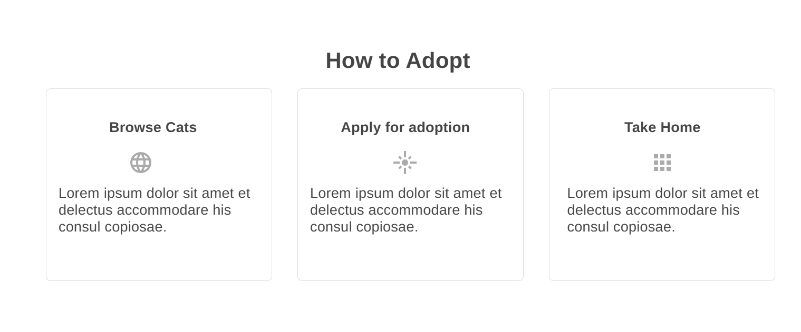
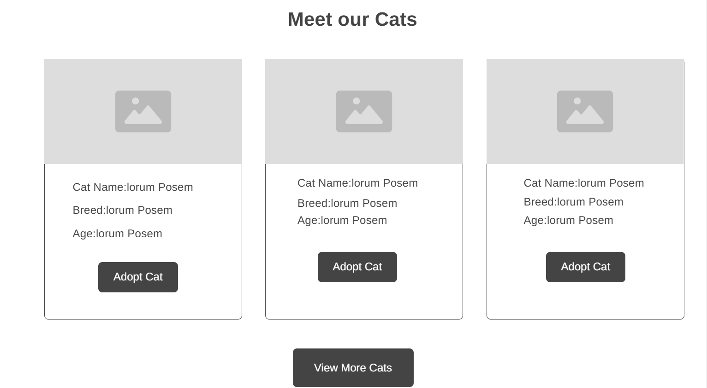
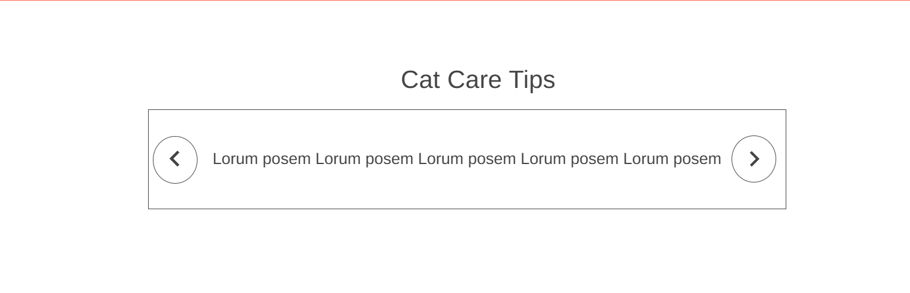
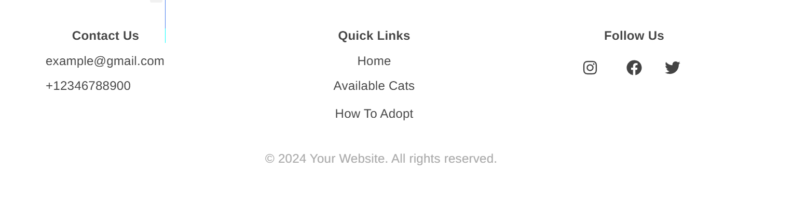
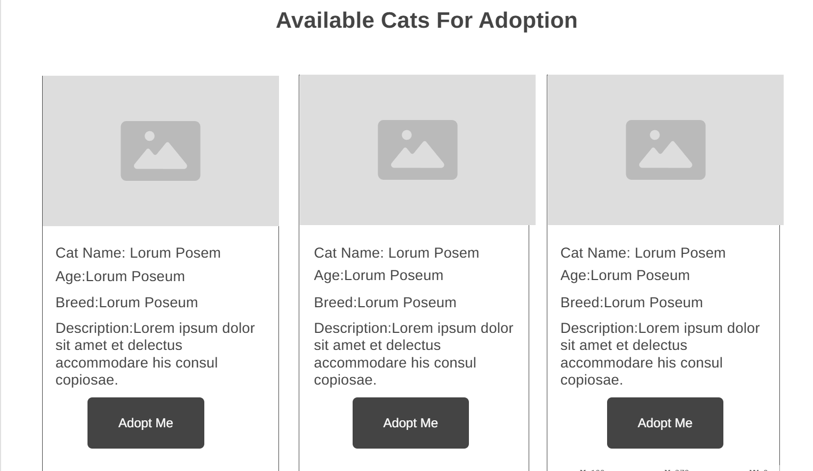
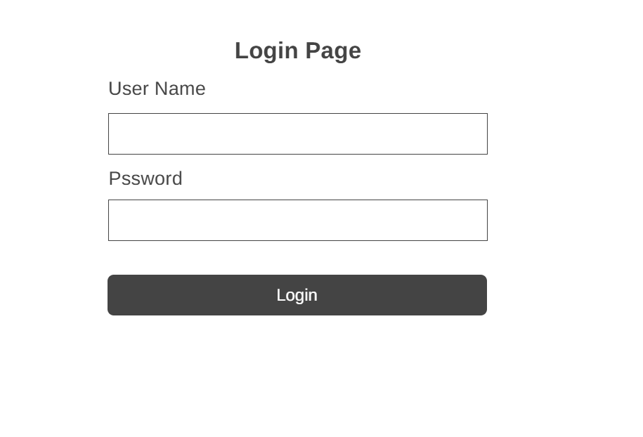
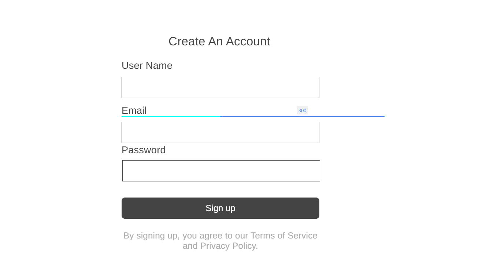
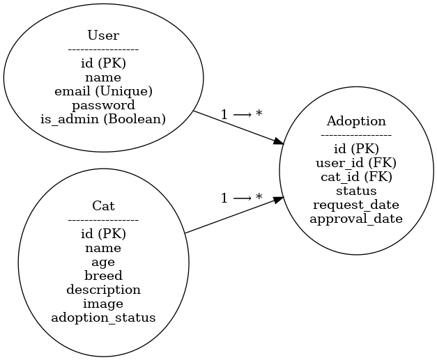

# **🐾 Kitty Connect** – *Find Your Purr-fect Companion!*

Kitty Connect is a full-stack web application built with Django that connects cat lovers with adoptable cats. The platform enables users to browse available cats, apply for adoption, manage favorites, and track their adoption requests. Administrators can manage cat listings and process adoption requests.

---

## Table of Contents
1. [Project Overview](#project-overview)
2. [Target Audience](#target-audience)
3. [Wireframes & User Flow](#wireframes--user-flow)
4. [Features](#features)
5. [Future Improvements](#future-improvements)
6. [Technology Stack](#technology-stack)
7. [Database Schema](#database-schema)
8. [Installation & Setup](#installation--setup)
9.  [Testing](#testing)
10. [Deployment](#deployment)
11. [Content & Media](#content--media)
12. [Credits & Acknowledgements](#credits--acknowledgements)

---

## Project Overview
Kitty Connect is designed to simplify the cat adoption process. The application allows users to:
- **Browse:** View a curated list of adoptable cats with images, breed, age, and detailed descriptions.
- **Apply:** Submit adoption requests with personalized messages.
- **Track:** Monitor the status of their requests via a user dashboard.
- **Favorite:** Save cats they are interested in to a wishlist.

Administrators have access to an admin dashboard where they can:
- **Manage Cat Listings:** Add, update, or remove cats from the platform.
- **Process Requests:** Approve or reject adoption requests.
- **Maintain Integrity:** Ensure that adopted cats are removed from the available listings and restrict reapplication for rejected cats for a specified period (6 months).

---

## Target Audience
- **Cat Lovers:** Individuals or families looking to adopt a cat.
- **Animal Shelters & Rescue Organizations:** Entities wanting to list cats available for adoption.
- **Administrators:** Site managers responsible for overseeing adoption requests and managing cat listings.

---

## Wireframes & User Flow
### Wireframes
Wireframes were created to establish the layout and structure of key pages:
- **Homepage:** Features a hero banner, sections for "What We Do," "Why We Do," "How to Adopt," "Meet Our Cats," and "Cat Care Tips."

- **Cat List Page:** Displays a grid of cat cards with filters and action buttons.

- **Log in Form Page:** Contains a simple form for users to login kitty connect.

- **Sign up page:** Contains a simple form for users to register in kitty connect.

*

### User Flow Diagrams
User flow diagrams map the steps a user takes:
- **User Journey:** From browsing cats to submitting an adoption request, tracking its status, and managing favorites.

                       +----------------+
                       |   Homepage     |
                       +----------------+
                              |
              +---------------+----------------+
              |                                |
              v                                v
       +-------------+                 +-----------------+
       | Register /  |                 |   Login         |
       |  Login      |                 +-----------------+
       +-------------+
              |
              v
       +-----------------------+
       | Browse Available Cats |
       +-----------------------+
              |
              v
       +-----------------------+
       |   Cat List Page       |
       +-----------------------+
                        |
              +---------+---------+
              |                   |
              v                   v
           +----------+   +------------------+
           | View Cat |   |  Add to Favorites|
           | Details  |   +------------------+
           +----------+
                 |
                 v
             +---------------------------+
             | Adoption Request Form     |
             | (Apply for Adoption)      |
             +---------------------------+
                         |
                         v
        +---------------------------+
        | Submit Adoption Request   |
        +---------------------------+
                  |
                  v
        +---------------------------+
        |   User Dashboard          |
        | (Track Requests, History, |
        |  Manage Favorites)        |
        +---------------------------+

      

- **Admin Flow:** From logging into the admin dashboard to managing cat listings and processing requests.

                        +----------------+
                        |  Admin Login   |
                        +----------------+
                              |
                              v
                        +----------------+
                        | Admin Dashboard|
                        +----------------+
                              |
               +--------------+--------------+
               |                             |
               v                             v
       +-----------------+          +-------------------------+
       | Manage Cats     |          | Manage Adoption Requests|
       | (Create/Edit/Delete)      | (Review, Approve, Reject)|
       +-----------------+          +-------------------------+

---

## Features
### For Users
- **User Authentication:** Registration, login, logout, and role-based access.
- **Cat Listings:** Browse adoptable cats with images, breed, age, and detailed descriptions.
- **Adoption Request:** Submit an adoption request with a custom message.
- **Favorites:** Save cats to a wishlist for future reference.
- **User Dashboard:** View active requests, adoption history, and favorite cats.

### For Admins
- **Cat Management:** Create, update, and delete cat listings.
- **Adoption Request Management:** Review, approve, or reject adoption requests.
- **Role-Based Access:** Only admins can access the admin dashboard.
- **Security Features:** Prevent duplicate submissions and restrict reapplication for rejected requests for 6 months.

---

## 🔄 Future Improvements
- Cloud-based DB (PostgreSQL for Heroku)
- Email notifications
- Enhanced search and filtering
- Add user testimonials
- REST API for mobile version

## Technology Stack
- **Frontend:** HTML5, CSS3, JavaScript, Bootstrap
- **Backend:** Python 3, Django 4.2
- **Database:** SQLite (development) 
- **Static Files:** Managed with WhiteNoise
- **Environment Management:** django-environ for secure configuration
- **Version Control:** Git and GitHub

---

## Database Schema
### Main Models:
- **Cat:**  
  - `name`: CharField  
  - `breed`: CharField  
  - `age`: IntegerField  
  - `description`: TextField  
  - `image`: ImageField  
  - `available`: BooleanField  
- **AdoptionRequest:**  
  - `user`: ForeignKey (User)  
  - `cat`: ForeignKey (Cat)  
  - `message`: TextField  
  - `status`: CharField (choices: Pending, Approved, Rejected)  
  - `request_date`: DateTimeField  
- **Favorite:**  
  - `user`: ForeignKey (User)  
  - `cat`: ForeignKey (Cat)

## 📅 Agile Methodology
### Tools
- **GitHub Projects** for Epics, User Stories, and Tasks

### Examples
- **User Story:** As a user, I want to apply for adoption and get notified of updates.
- **Tasks:** Design form, set up model, build view, add email confirmation (if applicable)
- **Acceptance Criteria:** Can apply, view status, reapply restriction enforced

All user stories are mapped to project goals and documented in GitHub issues.

## Testing 

### Table of Contents
1. [Introduction](#introduction)
2. [Automated Testing](#automated-testing)
3. [Manual Testing](#manual-testing)
4. [Usability Testing](#usability-testing)
5. [Accessibility Testing](#accessibility-testing)
6. [Responsive Testing](#responsive-testing)
7. [Performance Testing](#performance-testing)
8. [Security Testing](#security-testing)
9. [Known Bugs](#known-bugs)

## Introduction
 The purpose of these tests is to ensure that the website operates as expected and provides a secure, efficient, user-friendly experience.

## Automated Testing
### Django Tests
#### Models
- **Cat Model Test:**
  - Purpose: Ensure the cat model stores all necessary data correctly.
  - Method: Create a cat instance and verify each field.
  
#### Forms
- **Adoption Form Test:**
  - Purpose: Check the adoption form validation and data handling.
  - Method: Submit the form with both valid and invalid data.

#### Views
- **Login Required Test:**
  - Purpose: Confirm that pages requiring a login cannot be accessed anonymously.
  - Method: Access the URLs without logging in and expect a redirect to the login page.

### Integration Testing
- **User Flow Test:**
  - Purpose: Simulate a user's action from logging in to adopting a cat.
  - Method: Use Selenium to test a series of actions performed by the user.

## Manual Testing
### Navigation
- **Links:**
  - All navigation links are tested to ensure they point to the correct pages.

### Forms
- **Adoption Application:**
  - Test each field for validation rules and check the submission process.
  
## Usability Testing
- **User Feedback:**
  - Collect feedback from a group of users to identify any usability issues.

## Accessibility Testing
- **Screen Reader Tests:**
  - Use tools like NVDA and VoiceOver to test accessibility.
- **Color Contrast:**
  - Verify that text is readable and elements are distinguishable.

## Responsive Testing
- **Device Testing:**
  - Test the website on various devices (mobile, tablet, and desktop) to ensure layouts adapt correctly.

## Performance Testing
- **Load Time:**
  - Use tools like Google PageSpeed Insights to test and optimize the load time.

### Bugs
- **Resolved:** Local images not displaying (fixed media file path and settings)
- **Resolved:** Admin redirect logic from login
- **Known:** None at time of submission

## 🚧 Deployment

### Steps
1. Install dependencies: `pip install -r requirements.txt`
2. Set `DEBUG=False` and configure `.env`
3. Use Cloudinary for media
4. Push to Heroku Git or connect to GitHub repo

### Files
- `Procfile`
- `requirements.txt`
- `.env`
- `.gitignore`

### Security
- `SECRET_KEY`, `DB`, `DEBUG` are hidden in `.env`
- `ALLOWED_HOSTS` set for Heroku

## Credits
### Content
- The text for cat profiles was copied from ChatGPT

### Media
- Cat images were sourced from [Unsplash](https://unsplash.com).

## Acknowledgements
- I would like to thank my mentor Tim Nelson at [Code Institute](https://codeinstitute.net) for their guidance.
